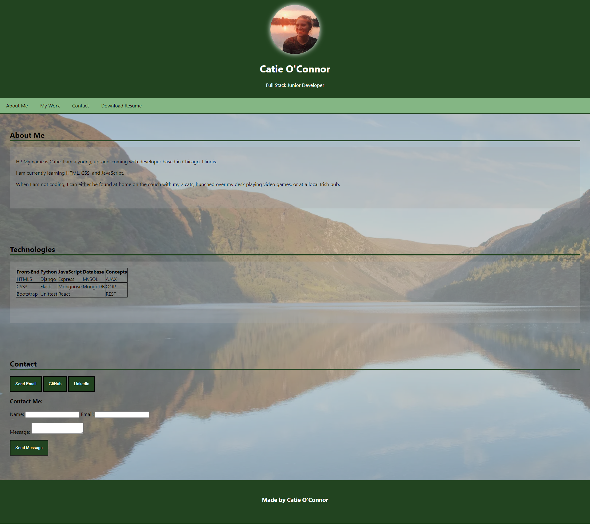

# CatieO_Portfolio

## Description

This is my portfolio website which describes myself and shows the work I have completed. It also contains buttons at the bottom that provide ways to contact me, and view my LinkedIn and GitHub pages.

This is my first "go" at creating my own porfolio website from scratch as an assignment for coding bootcamp. I plan to continue working on this as my skills evolve.

My portfolio now includes a link to download my most current Resume.

## Screenshot

## Links to Application

- Here is the link: [coconnor10/My-Portfolio] (https://github.com/coconnor10/My-Portfolio)
- Here is the deploy page: [coconnor10/pages] (https://coconnor10.github.io/My-Portfolio/)
